# OpenFlight Companion

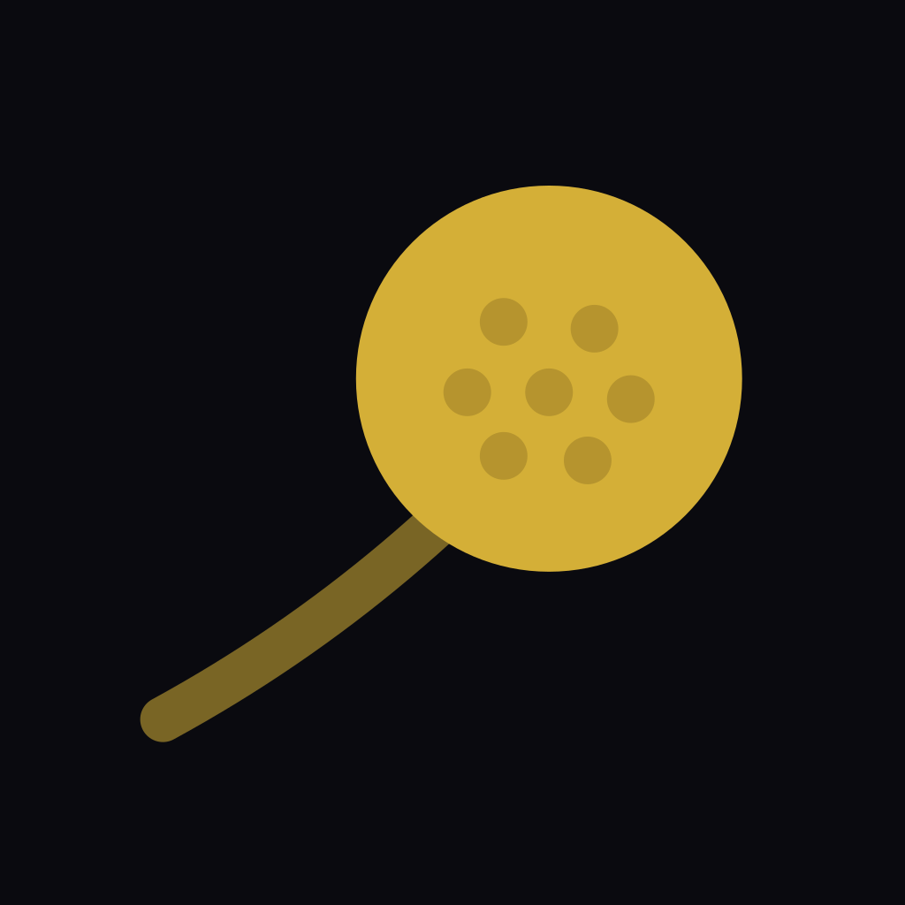

An Android + iOS companion app for [OpenFlight](https://openflight.dev), the DIY golf launch
monitor. It talks to the Pi over the network, Wi-Fi or Ethernet (the Pi's own Socket.IO API, plus
Server-Sent Events on backends that have them), or Bluetooth LE (schema 2). See
[Backend compatibility](#backend-compatibility) for which backend offers what. Each platform has a
**native UI**, Jetpack Compose on Android and SwiftUI on iOS, over the same shared Kotlin
Multiplatform ViewModels, repositories, transports and ball-flight geometry
([ADR 0001](docs/adr/0001-native-ui-shared-viewmodels.md),
[ADR 0002](docs/adr/0002-ios-range-canvas-renderer.md)).

<br clear="left"/>

## Screenshots

iOS, connected to `openflight-server --mock` (22 simulated shots across six clubs):

| Practice | Driving range | Session and dispersion |
|---|---|---|
| 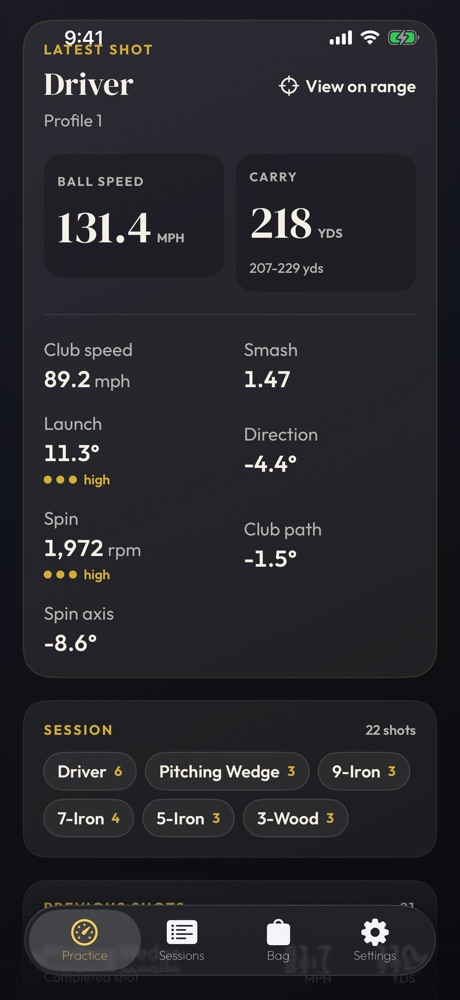 | 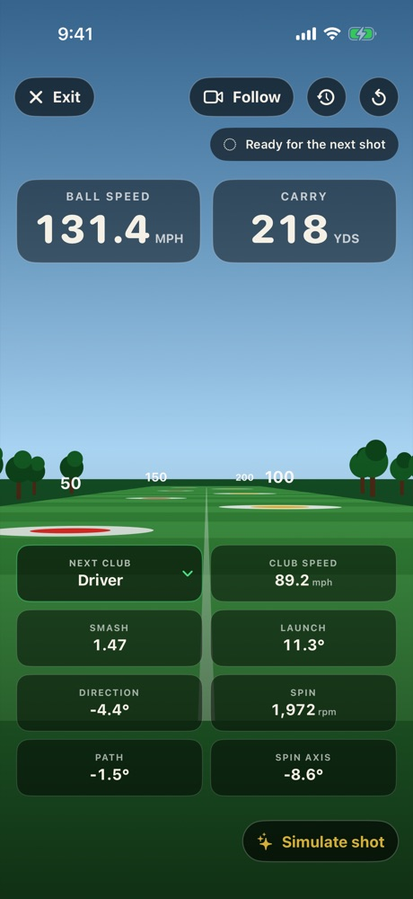 | 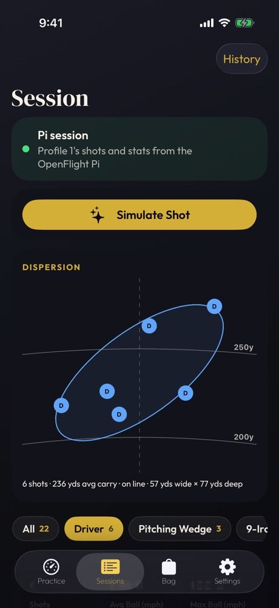 |

| My Bag | Club analysis | Stored session |
|---|---|---|
| 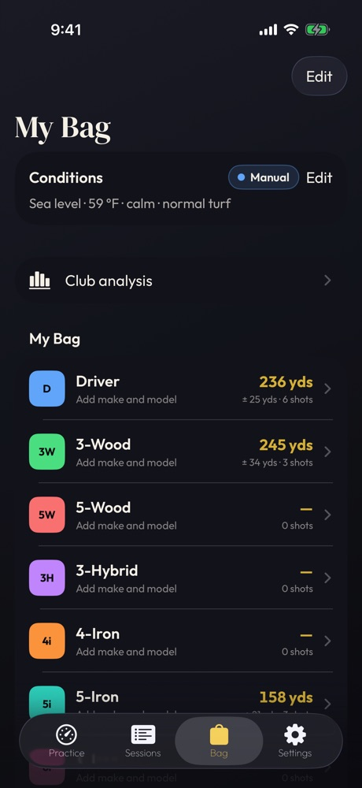 | 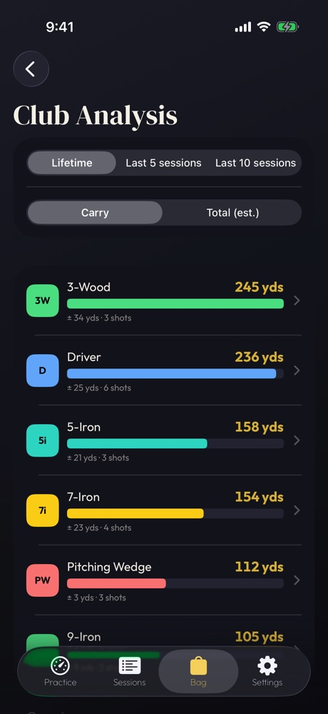 | 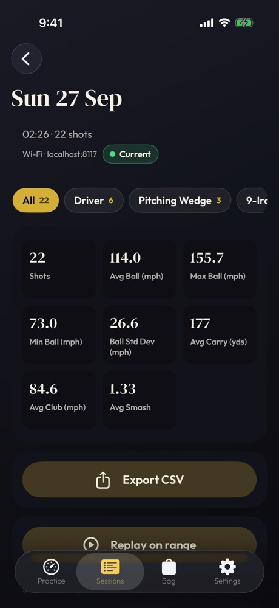 |

Android, same build and server:

| Practice | Session | My Bag | Settings |
|---|---|---|---|
| 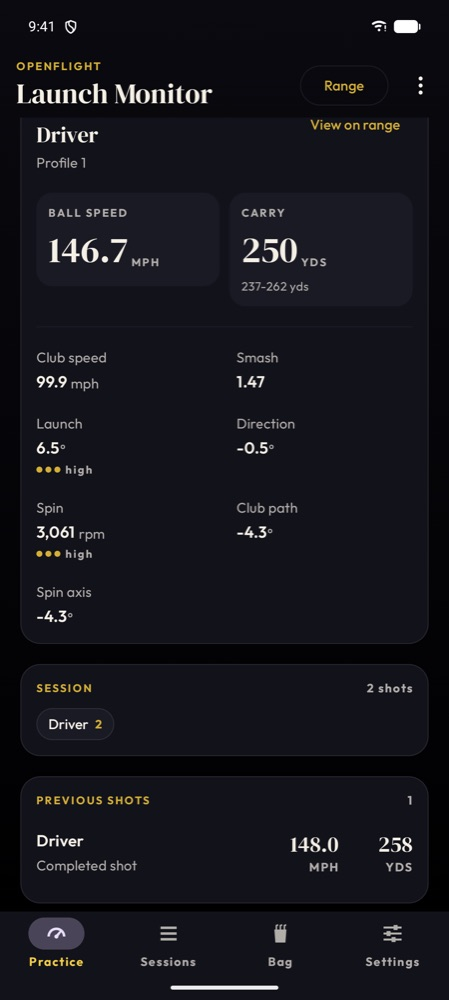 | 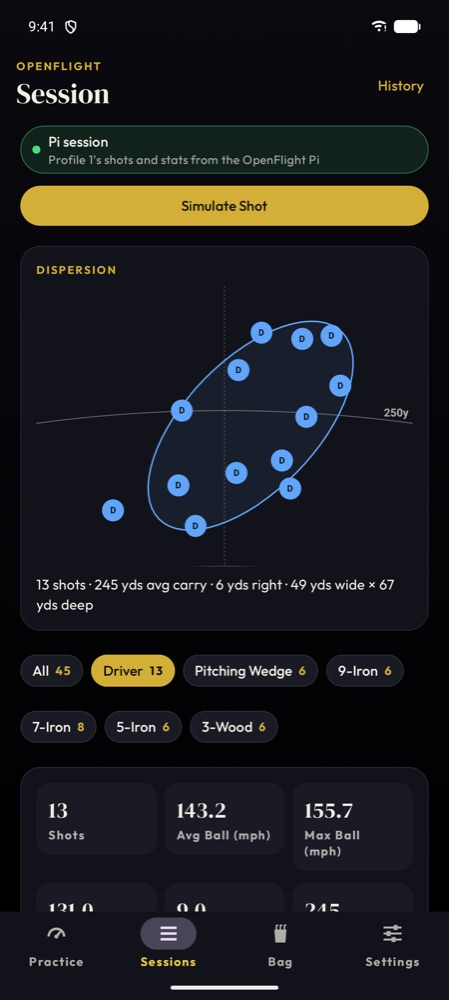 | 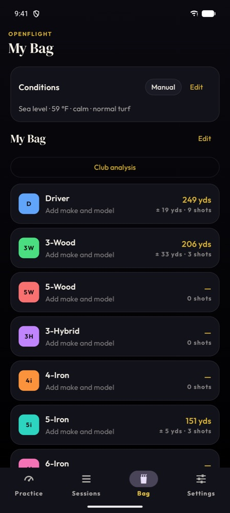 | 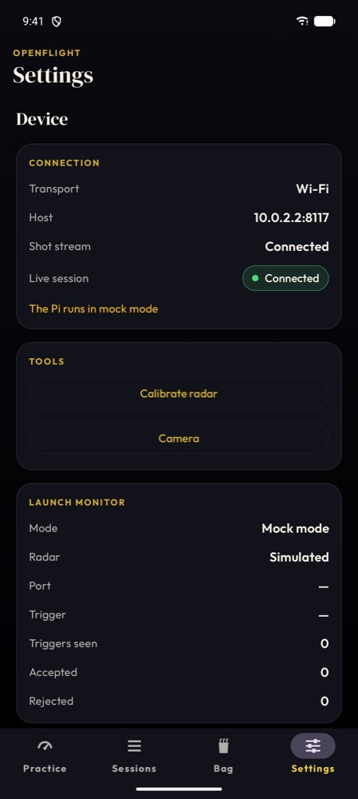 |

Phones get a bottom bar (Android) or tab bar (iOS); tablets get a navigation rail (Android)
or a sidebar (iPad), with list-detail layouts for Sessions, history and Bag.

## Features

The app has four tabs on both platforms: **Practice · Sessions · Bag · Settings**.

### Practice (live)
- **Live shots over the network or Bluetooth LE.** On **Network** (the Pi on Wi-Fi or Ethernet)
  the app keeps one Socket.IO connection to the Pi (the API the Pi's own web UI uses) and, on backends that serve it, the SSE shot stream
  (`/api/shots/stream?schema=2`); on a Pi without that stream, such as stock upstream, the
  Socket.IO `shot`/`shot_update` events feed the live shots instead. Both reconnect on their own
  with capped exponential backoff
  (Socket.IO 0.5 s → 5 s, SSE 1 s → 15 s). Bluetooth needs the Pi's schema 2 build: the app
  negotiates schema 2 and has no version-one fallback ([Bluetooth LE](#bluetooth-le-schema-2)).
- **The latest shot**: ball speed and carry (or the carry range), club speed, smash, launch,
  direction, spin, club path and spin axis, with confidence dots and the spin source. A haptic
  and a gold flash mark each new shot, and "View on range" flies it.
- A **processing indicator** shows the Pi's `shot_processing` state (capturing, calculating,
  failed). A schema v2 provisional shot is replaced in place by its final version.
- **Club selection**, synced both ways with the Pi and the kiosk (`POST /api/club`, or Socket.IO
  `set_club` on a Pi without that route). The phone never shows a club
  the Pi hasn't confirmed, and asks once per launch whether the Pi's club is right. Per-club shot
  chips with counts show the session so far.
- **Profiles**: a picker beside the club selects the Pi's active profile, and adds, renames and
  removes profiles under the server's rules (at most 12, never zero; names trimmed to 40
  characters; the active profile and one with shots can't be removed). Over Bluetooth v2 the
  picker is select-only.
- **Connection problems** each get their own message and action: an unreachable Pi, an address
  the endpoint policy refuses, and denied local-network access on iOS or Android 17 (with a
  button to open Settings). Besides the default `raspberrypi.local:8080`, a tap-to-fill host covers a typical home network.
- **Simulate shot** appears only when the Pi runs `--mock`.
- The overflow menu opens **speed training** (swing-speed mode with implement selection, Network).

### Driving range
- A ball-flight view drawn from **shared Kotlin geometry** on both platforms: Compose `Canvas`
  on Android and SwiftUI `Canvas` on iOS, so the two look the same by construction.
- **Accurate flight**: the backend's aerodynamics (Ferguson, McNally & McPhee 2022 drag and
  lift with spin decay), with the carry matched by a drag fit, so the drawn landing equals the
  displayed carry. Validated against tour-average launch data.
- A **fixed** tee-side camera or a **follow camera** that chases the ball and settles on the
  landing spot. Reduced motion forces the fixed view.
- **Replay and overlay**: step through a session shot by shot at 0.5x/1x/2x, or overlay up to
  200 shots from one session or all of them, filtered by club. A session picker opens any stored
  session. Gestures: pinch to zoom, pan, orbit, double-tap to reset, tap a landing to select it.
- **View any shot on the range** from Practice, Sessions, history and Bag.
- The estimated roll-out and total show with an "est." label.

### Sessions
- **The Pi's session** for the active profile, grouped by club, with per-club stats (count,
  average/min/max ball speed and its standard deviation, average carry, club speed and smash).
- A **dispersion map**: one dot per shot, a scatter ellipse per club and distance arcs, with a
  selected-shot card.
- **CSV export** through the Android share sheet or the iOS `ShareLink`.
- **Delete and Clear are server-confirmed** on Network: a row shows a pending state until the Pi
  confirms, and fails after 10 s, on `delete_shot_error` or when the link drops.
- **History**: every connection to the Pi starts a session stored on the phone (Room; survives
  relaunches), listed newest first and filterable by profile. Each stored session has the same
  stats, a CSV export and "Replay on range".

### Bag
- **My Bag**: 14 default clubs to start, which you can add to, remove and reorder, each with
  make, model and loft. More than one bag, with one active. Each club shows its average carry,
  its spread and the gap to the next club.
- **Club analysis**: ranked carry bars over your lifetime or the last 5 or 10 sessions, a
  Carry | Total (est.) toggle, and gapping insights (overlaps and gaps between clubs).
- **Club detail**: a carry histogram, the dispersion ellipse and recent shots with "View on
  range".
- **Playing conditions**: altitude, temperature, wind, turf firmness and target bearing adjust
  the estimated carry and roll through air density and wind. Every adjusted number is labelled
  "est."; the Pi's carry stays the anchor.

### Settings
- **Device**: connection and transport, the live link, and cards for power (a Pi started with
  `--battery`), trigger, radar tuning and debug recording, each hidden until the Pi reports it.
  From here: **Calibrate radar** and **Camera**.
- **Stop OpenFlight** goes confirm → pending → done or failed, with a 10 s timeout, and never
  reaches a Pi you switched to since confirming.
- **Phone-assisted radar tilt calibration**: sample the phone's gravity sensor at 60 Hz, wait
  for a stable 2-second average, and send it to calibrate the TI IWR6843's mount tilt.
- **Camera** (Network): the Pi's capture settings, a preview still polled only while visible, and
  each shot's replay video.
- **Audio call-outs**: the phone reads out each shot (or games only) with the fields and order
  you choose (carry, total, ball speed, club speed, smash, launch, spin, …), a voice picker and a
  speech rate. Off by default, and silent while TalkBack or VoiceOver is running.
- **Units** (Imperial or Metric), simulator (GSPro) status, cloud-upload status.

### Everywhere
- **Endpoint policy**: `http://` only to loopback, `.local` names and private addresses;
  `https://` to any host. The app remembers a host only after it connected.
- **Lifecycle**: every transport disconnects in the background and reconnects on return; a
  pending delete, clear or shutdown then fails with "connection dropped" instead of hanging.
- **Accessibility**: metric tiles and rows announce as one phrase for TalkBack/VoiceOver, the
  connection chip announces changes on its own, touch targets are at least 48 dp / 44 pt, no
  status relies on colour alone, and reduced motion is respected.
- **Bluetooth carries less than Network**: what BLE can't carry is disabled with an explanation,
  not hidden (see [Known limitations](#known-limitations)).

## Status and roadmap

What changed in each release is in [`CHANGELOG.md`](CHANGELOG.md).

Done and on `main`:

- [x] Live shots over the network (Socket.IO + SSE) and Bluetooth LE schema 2
- [x] Live shots and club changes on a stock upstream Pi (Socket.IO only, no SSE or `/api/club`)
- [x] Practice: latest shot, confidence, processing indicator, connection problems, club sync
- [x] Profiles: select, add, rename, remove
- [x] Driving range on shared geometry (Compose `Canvas` / SwiftUI `Canvas`), follow camera
- [x] Accurate ball flight (drag and lift model, drag-fit carry)
- [x] Range replay, overlay, gestures and "view any shot on the range"
- [x] Session stats, dispersion map, CSV export, server-confirmed delete and clear
- [x] Stored session history (Room), with replay on the range
- [x] My Bag, club analysis and gapping
- [x] Conditions-adjusted carry, wind and estimated roll (manual conditions)
- [x] Audio call-outs
- [x] Device cards, radar calibration, camera, speed training, Pi shutdown
- [x] Tablet layouts: Android navigation rail, iPad sidebar, list-detail screens
- [x] CI on Linux and macOS, `MockServerIT` against two pinned backends, Dependabot
- [x] `v0.1.0-sim` tagged (verified on simulators and emulators)

Next:

- [ ] Estimated total and roll on Practice, Sessions, history and CSV, plus a "show total" toggle
- [ ] Automatic conditions from location and Open-Meteo weather in the UI (the engine is done;
      the Bag screen only offers manual conditions so far)
- [ ] Games and activities: a **Play** tab with target call-out, closest to the pin, bullseye,
      golf pong and iconic shots (the engine is done; no screens yet)
- [ ] Range themes and atmosphere (dusk, night, links), a top-down view, and your own range
      photo as a backdrop
- [ ] Session sharing and ghost play against a shared session
- [ ] Real course and driving-range layouts from OpenStreetMap
- [ ] Extras such as starred shots, personal bests and a wedge matrix (to be chosen)
- [ ] Tablet QA sweep and documentation pass
- [ ] Hardware test matrix on a real Pi (see [`docs/hardware-test-matrix.md`](docs/hardware-test-matrix.md)), then `v0.1.0`
- [ ] The phone-connectivity backend (SSE, `/api/club`, BLE, phone calibration) upstream
- [ ] Kiosk features not in the app yet: editing camera capture settings and exposure, live
      trigger diagnostics, languages other than English, a light theme, finding the Pi by mDNS
- [ ] Units synced with the kiosk (needs the server to own the setting)

## Backend compatibility

The app works with more than one OpenFlight server. What it can do depends on which one the Pi
runs:

| | Upstream `main` ([open-flight/openflight](https://github.com/open-flight/openflight)) | Fork branch `feat/phone-connectivity` ([btripp/openflight](https://github.com/btripp/openflight/tree/feat/phone-connectivity)) |
|---|---|---|
| Socket.IO session: snapshot, profiles, Session screen, server-confirmed delete/clear, stats, stored history, device cards, power, camera, training, shutdown | Yes | Yes |
| Live shots on the Practice latest-shot card and the range | Yes, over Socket.IO: there's no SSE stream (`/api/shots/stream` answers 404), so the app feeds the live feed from the Pi's `shot`/`shot_update` and shows Connected while the Socket.IO link is up. It probes SSE once per connection, not on a retry loop | Yes, over the SSE stream with schema v2 (`?schema=2`); Socket.IO only enriches it |
| Change the club from the phone over Network | Yes, over Socket.IO `set_club` (there's no `/api/club`); the phone shows the club once the Pi's `club_changed` confirms it | Yes, `POST /api/club` |
| Phone calibration (`/api/calibration/iwr6843/orientation`) | No | Yes |
| Bluetooth LE | None | Schema 2 only; the app needs the Pi's schema 2 build. An older build that still offers only the v1 characteristics gets a "needs its Bluetooth update" message: use Network |
| `MockServerIT` (pinned in CI) | `7ca4b40`: all 26 pass (asserting the Socket.IO fallbacks) | `07d5313`: all 26 pass |

The fork branch is upstream `main` plus the phone transport from
[`jake-fishtech/openflight@feat/iOS-ble`](https://github.com/jake-fishtech/openflight/tree/feat/iOS-ble)
(SSE, `/api/club`, phone calibration) and BLE schema 2, which has replaced that branch's BLE v1.
It isn't upstream yet. A Pi running jake-fishtech's branch itself speaks only BLE v1, which this
app no longer supports, so connect to it over **Network** instead (its SSE v1 stream still works).
Its Socket.IO API predates profiles, so the profile, power and processing features stay empty
there.

HTTPS (`--tls-cert`/`--tls-key`) is on a separate backend branch, `feat/lan-https`, not in
either column yet. See [Network security](#network-security).

### Bluetooth LE: schema 2

Bluetooth needs the Pi's schema 2 build. Its GATT service, `b6f633f2-e6e3-45ae-84b4-968ecca2d9c7`,
has exactly two characteristics:

| Characteristic | UUID | Use |
|---|---|---|
| shot | `ed365fe6-3abf-4fc3-8e44-d9525a22dabd` | notify: schema 2 shot events |
| control | `7ba96e63-12c2-4ce0-bb84-3513c7fd1474` | write + notify: commands, responses and events |

The version-one characteristics (`2b28f67e-…` shot, `7e3b5d6c-…` control) are gone from the Pi,
and the app never looks for them.

Negotiation, after discovery:
1. The app requires both characteristics. Without them it stops with "The Pi needs its
   Bluetooth update" (the Pi's Bluetooth predates schema 2); a v1-only Pi can still connect over
   Network.
2. It subscribes to control and sends `hello {"client_schema_max":2}` with the usual 10 s
   control timeout. Every response is `schema_version` 2.
3. Once the Pi answers schema 2, it subscribes to shots, then syncs `get_club`, `get_profiles`
   and `get_power_status`.
4. `ok:false` (the Pi refuses anything below schema 2, and an older Pi doesn't know `hello`), a
   timeout or a failed subscription is an error state that says why. There's no version-one
   fallback. Retry negotiates again.

The `hello` result lists the Pi's features (`provisional_shots`, `shot_processing`, `profiles`,
`power_status`, `shot_deleted`, `club`). Later additions such as `shot_catch_up` are detected,
never required.

Every message is split into 20-byte frames, which fits Android's default ATT MTU. The SSE
stream (Network) negotiates separately and keeps its fallback: `?schema=2`, with a plain v1
stream for a Pi that answers `400` (jake-fishtech's ignores the parameter and sends v1).

Schema v2 adds `shot_number`, the profile, and **provisional and final** shots that share an
`event_id` (the app replaces one with the other). It adds the events `club_changed`,
`profiles`, `shot_processing`, `power_status`, `session_cleared` and `shot_deleted`, and the
commands `get_club`/`set_club`, calibration, `get_profiles`, `set_active_profile` and
`get_power_status`. BLE has no authentication, so it is **read-and-select only**: the Pi
refuses `delete_shot` and `clear_session` over BLE, and the app disables Delete and Clear there
with a "Network only" explanation. Deletes and clears made elsewhere still reach the phone
through `shot_deleted` and `session_cleared`. The frame format is specified in the backend's
`docs/ios-ble.md`.

### Supported setups

- **Phone as the only interface to a headless Pi.** No screen on the Pi: the app does
  everything, over Network (the Pi's LAN address, on Wi-Fi or Ethernet) or Bluetooth.
- **Phone plus the Pi's kiosk.** Both are clients of the same server, and every server event is
  a broadcast. The club, active profile, debug mode and radar settings are global to the Pi, so
  a change on either shows on both, and a shot deleted or a session cleared on one disappears
  on the other.
- **Phone plus `/display`.** A TV or monitor shows the Pi's passive `/display` page in a
  browser while the phone does the controlling. The display follows the same broadcasts.

The units toggle is the one setting that doesn't cross over: the kiosk and `/display` keep
their own. Each setup has a row in [`docs/hardware-test-matrix.md`](docs/hardware-test-matrix.md).

## Module map

| Path | What |
|---|---|
| `androidApp/` | Android application: `MainActivity`, the Jetpack `navigation-compose` nav host (Practice/Sessions/Bag/Settings on a bottom bar or navigation rail; Range, Calibrate, Training, Camera and history pushed), runtime permission prompts, launch-option intent extras, Koin start, the app icon |
| `shared/` | KMP, no UI: common Koin bootstrap (`initKoin`), `LaunchOptions`, the preview repositories, and the iOS umbrella framework `Shared.framework` (exports `core:*` and every `feature:*` ViewModel module, plus `KoinHelper` and the `NativeViewModels` bridge for Swift) |
| `iosApp/` | Xcode project (SwiftUI): a `TabView` on iPhone and a `NavigationSplitView` sidebar on iPad; embeds `Shared.framework` through a Gradle build phase; `Bridge/ViewModelHost.swift` collects shared `StateFlow`s via KMP-NativeCoroutines |
| `core/model` | Pure data types: `ShotEvent`, `GolfClub`, `ConnectionState`, calibration and Pi (`pi.*`) models. No I/O. |
| `core/protocol` | The wire-protocol codec: BLE frame encoder/reassembler, `ShotEventDecoder`, SSE parsing, control envelopes, the `ShotTransport` interface. No I/O. |
| `core/ble`, `core/network` | The BLE (Kable-backed) and Wi-Fi/SSE transports, both implementing `core/protocol`'s `ShotTransport` |
| `core/socketio` | A minimal Engine.IO v4 / Socket.IO v5 client over a Ktor WebSocket, which `core/data`'s `PiSessionRepository` uses for the Pi's session API |
| `core/data` | The repositories the UI observes as `Flow`s (shots, settings, Pi session, history, bag, conditions); enriches SSE/BLE shots with Socket.IO detail and writes every shot through to the history |
| `core/database` | Room 3 KMP (bundled SQLite): sessions, shots, bags, activities and imported sessions, used only by `core/data`. Exported schemas live in `core/database/schemas/` |
| `core/flight` | Ball-flight physics (drag, lift, spin decay, air density, wind, roll) and the camera planners |
| `core/insights` | Units, per-club stats, gapping analysis, CSV export, shot formatting |
| `core/speech` | Text-to-speech engine and the shot call-out composer |
| `core/location`, `core/geodata` | A one-shot coarse location fix, and the Open-Meteo weather and elevation client, for automatic conditions |
| `core/sensors` | Gravity sensor `expect`/`actual` and the phone-orientation calibration math |
| `core/designsystem` | Android-only (Jetpack Compose): the `Of*` component wrappers every feature UI must use instead of raw Material3, including the adaptive scaffold; bundles DM Serif Display + Outfit (OFL) |
| `core/testing` | Fake repositories shared by VM tests |
| `feature/dashboard`, `range`, `session`, `bag`, `calibration`, `training`, `camera`, `settings`, `games` | KMP, shared presentation: each screen's `ViewModel`, `UiState`, events and pure helpers (no Compose in `commonMain`, enforced by `verifyNoComposeInCommonMain`). `games` has no screens yet |
| `feature/<name>/ui` | Android-only (Jetpack Compose): that screen's composables and its device UI tests |
| `build-logic/` | Gradle convention plugins (`openflight.*`) |
| `gradle/libs.versions.toml` | Single source of truth for versions |
| `tools/` | Dev helpers (`fire-mock-shot.py`, the BLE frame-golden generator) |
| `docs/` | ADRs, the hardware test matrix, and the README images |
| `plans/openflight-kmp-app.md` | The build plan: **§0 is the wire-protocol reference, and §9.1 supersedes it for the current backend** |

The dependency graph lives in [`CLAUDE.md`](CLAUDE.md#module-graph-arrows-point-from-a-module-to-its-dependencies-core-never-depends-on-featureapp).
The rules: `core:*` never depends on a feature, `shared` or an app, and no feature depends on
another feature.

## Building

Requirements: JDK 17+ (Android Studio's bundled JBR works), the Android SDK (`sdk.dir` in
`local.properties`), and Xcode 26+ for iOS.

```bash
export JAVA_HOME="/Applications/Android Studio.app/Contents/jbr/Contents/Home"   # if no system JDK

./gradlew spotlessCheck detekt          # formatting + static analysis
./gradlew allTests                      # Android host tests + iOS simulator tests, every module
./gradlew :androidApp:assembleDebug     # Android APK
./gradlew :shared:linkDebugFrameworkIosSimulatorArm64

xcodebuild -project iosApp/iosApp.xcodeproj -scheme iosApp \
  -destination 'generic/platform=iOS Simulator' CODE_SIGNING_ALLOWED=NO build
```

Run `./gradlew spotlessApply` before committing. The Xcode build phase falls back to
Android Studio's JBR when `JAVA_HOME` is unset, because Xcode doesn't inherit your shell
environment.

### iOS signing

The checked-in project has no team configured, so a fresh checkout will show "no account for
team" or a provisioning error on a device. Set it once per machine, **outside version control**:

1. In Xcode, **Xcode > Settings > Accounts**, add your Apple ID.
2. Copy `iosApp/Configuration/Local.xcconfig.example` to `iosApp/Configuration/Local.xcconfig`
   (gitignored) and set `TEAM_ID` to your team ID. `Config.xcconfig` includes it last, so it
   also takes a `PRODUCT_BUNDLE_IDENTIFIER` override if `dev.openflight.companion` isn't yours
   to use, and a `CURRENT_PROJECT_VERSION` for an upload.
3. Leave **Automatically manage signing** on. Don't pick the team in **Signing & Capabilities**:
   Xcode would write it into `project.pbxproj`, which is committed. `git diff` on that file
   should still show `DEVELOPMENT_TEAM = "${TEAM_ID}"`.

Running on the simulator (`CODE_SIGNING_ALLOWED=NO`) needs none of this.

### TestFlight

1. An Apple Developer Program membership, and an app record in App Store Connect for your
   bundle ID.
2. Bump `CURRENT_PROJECT_VERSION` for every upload (in `Local.xcconfig`, or in
   `Config.xcconfig` for a release): App Store Connect rejects a build number it has seen.
3. In Xcode, pick **Any iOS Device**, **Product > Archive**, then in the Organizer **Distribute
   App > App Store Connect > Upload**. Signing certificates stay in your Keychain.
4. Internal testers can install once the build has processed; external testers need Beta App
   Review first.

The app ships a privacy manifest (`iosApp/iosApp/PrivacyInfo.xcprivacy`, whose API reasons
match a scan of the Release binary; re-scan with `nm -u` after adding a dependency) and declares
`ITSAppUsesNonExemptEncryption = NO` (only the OS's own TLS), so uploads don't stop at export
compliance. Keep every credential out of the repo: `.gitignore` covers `Local.xcconfig`,
`*.p12`, `*.p8` (App Store Connect API keys), `*.cer`, provisioning profiles and
`ExportOptions.plist`.

### Releasing

Every user-facing change adds a line under `## [Unreleased]` in [`CHANGELOG.md`](CHANGELOG.md).
When you bump the build numbers for a release, move `[Unreleased]` into a new version section
(with the tag date, the iOS build and the Android `versionCode`) and add its compare link. Use
that section as the GitHub release notes and as the TestFlight "What to Test" text.

### Android release APK

`./gradlew :androidApp:assembleRelease` signs the APK only when your **user-level**
`~/.gradle/gradle.properties` (never the repo's) names a keystore:

```properties
openflight.release.storeFile=/Users/you/.android/openflight-release.jks
openflight.release.storePassword=…
openflight.release.keyAlias=openflight
openflight.release.keyPassword=…
```

Without those properties (CI, contributors) the release build still compiles, unsigned. Keep the
keystore and its passwords backed up outside the repo: an app signed with a lost key can't be
updated in place. Bump `versionCode` in `androidApp/build.gradle.kts` with each release, like
`CURRENT_PROJECT_VERSION` on iOS.

### Test commands

```bash
./gradlew allTests                                           # every module's host + iOS simulator tests
./gradlew :core:model:allTests :core:protocol:allTests        # a single module
./gradlew :feature:dashboard:ui:connectedDebugAndroidTest     # Compose UI tests, need a booted emulator/device
./gradlew :feature:session:ui:connectedDebugAndroidTest       # likewise for range, bag, calibration, training, camera, settings
./gradlew :androidApp:connectedDebugAndroidTest                # app-level navigation and flows
OPENFLIGHT_BACKEND_DIR=~/Developer/oss/openflight ./gradlew mockServerIT   # against a live mock server, see below
```

`allTests` runs `testAndroidHostTest` (JVM-hosted Android unit tests, no emulator needed) and
`iosSimulatorArm64Test` on every KMP module, `testDebugUnitTest` on the Android-only modules,
and `verifyNoComposeInCommonMain` (ADR 0001: shared code never mentions Compose). The
`connectedDebugAndroidTest` tasks are Compose UI tests and need a running Android emulator or
a connected device. CI doesn't run these; they run manually.

For iOS, first list the simulators actually installed on this Mac. **Simulator names aren't
portable**, so never hard-code one from another machine or from this README:

```bash
xcrun simctl list devices available
```

Then paste a UUID from that output into the destination:

```bash
xcodebuild test -project iosApp/iosApp.xcodeproj -scheme iosApp \
  -destination "platform=iOS Simulator,id=PASTE-SIMULATOR-UUID-HERE" \
  CODE_SIGNING_ALLOWED=NO

# unit tests only
xcodebuild test -project iosApp/iosApp.xcodeproj -scheme iosApp \
  -destination "platform=iOS Simulator,id=PASTE-SIMULATOR-UUID-HERE" \
  -only-testing:iosAppTests \
  CODE_SIGNING_ALLOWED=NO
```

### Integration test against a real mock server (`MockServerIT`)

`MockServerIT` (`core/data/src/androidHostTest`) runs the app's real data layer
(`DefaultShotRepository`, `DefaultPiSessionRepository`, the Ktor SSE/HTTP/Socket.IO clients,
DataStore settings and an in-memory Room history) against a live `openflight-server --mock`
from a backend checkout. It isn't part of `allTests`; it has its own task:

```bash
cd ~/Developer/oss/openflight && uv sync          # once per backend checkout
OPENFLIGHT_BACKEND_DIR=~/Developer/oss/openflight ./gradlew mockServerIT
# or: ./gradlew mockServerIT -Popenflight.backendDir=/path/to/openflight
```

Without a backend directory the task is skipped with a message. The test starts the server on
a free port with a temporary `HOME`, `--log-dir` and `--profiles-path` (plus `--battery
geekworm`, which reports `power_status` "unavailable" without the hardware), waits for it, and
walks: connect → snapshot (`session_state`, `profiles`, `trigger_status`, debug, power) →
`simulate_shot` → the shot over Socket.IO, into the stored history and over SSE → club change
→ add, rename, select and remove a profile → server-confirmed `delete_shot` (and
`delete_shot_error`) → `clear_session` for the active profile → debug, radar, training and
camera commands → disconnect and reconnect → `POST /api/shutdown` and the expected link drop.
On upstream `main`, which has no SSE or `/api/club`, the same steps assert the Socket.IO
fallbacks instead (the shot reaches the live feed once, the club changes over `set_club`, and
the status is Connected despite the SSE 404). The log ends with a PASS/SKIP summary. The server
is killed on every path. CI runs it on
Linux against both pinned backends (`.github/workflows/mock-server-it.yml`) when app code
changes.

The job needs no Pi, emulator or simulator. It lives in the Android host-test source set
because that's the one JVM source set that can reach `core:data`'s internals and the Android
actuals of Ktor, DataStore and Room; a separate JVM module would need a `jvm()` target on
`core:data` and everything under it.

### Contract goldens

- **BLE/SSE goldens from the backend** (`core/protocol/src/commonTest/fixtures/openflight-ble/`):
  the backend's cross-language fixtures, copied verbatim. The
  [README there](core/protocol/src/commonTest/fixtures/openflight-ble/README.md) has the refresh
  steps; afterwards run `./gradlew :core:protocol:allTests :core:ble:allTests`.
- **Frame goldens** (`GoldenFrameTest`): framing only (the 20-byte fragmenter, unchanged in
  schema 2), over the reference's `shot_v1.json` payload. Regenerate with
  `tools/gen-frame-goldens.py` from the reference encoder; the script's header has the command.
- Screenshots taken during manual or device checks are build artifacts, not source: don't
  commit them. The only committed screenshots are the README's, in `docs/images/`.

### Launch options for previews and UI tests

Debug builds read launch hooks, so UI tests and manual checks don't need a live Pi. iOS takes
them as launch arguments; Android as intent extras (`--ez <name> true`, `--es transport wifi`,
`--es host <host:port>`) with the same names in snake_case:

| iOS argument | Android extra | Effect |
|---|---|---|
| `--ui-testing` | `ui_testing` | A fake shot repository; no transport ever starts |
| `--preview-shot` | `preview_shot` | Like `--ui-testing`, with one canned shot |
| `--preview-pi` | `preview_pi` | Like `--ui-testing`, plus a fake Pi with a profile roster, power and trigger status and a swing being calculated (picker, device cards, shutdown) |
| `--preview-pi-session` / `--preview-pi-session-stuck` | `preview_pi_session` / `preview_pi_session_stuck` | With `--ui-testing`: a connected fake Pi whose deletes and clears are confirmed after a short delay, or never |
| `--preview-history` / `--preview-history-stuck` | `preview_history` / `preview_history_stuck` | Two stored sessions whose deletes land after a delay, or never (also feeds Bag stats and range replay) |
| `--range-mode`, `--preview-flight` | `range_mode`, `preview_flight` | Open the driving range and fly the shot |
| `--transport wifi\|bluetooth`, `--host <host:port>` | `transport`, `host` | Seed the settings before the UI starts |
| `--preview-live-shots`, `--preview-history-bulk`, `--preview-pi-mock` | (iOS only) | A new shot every 5 s; a 220-shot stored session; a mock Pi, so "Simulate shot" shows |
| `--range-freeze-progress <0…1>`, `--range-realitykit` | (iOS only) | Freeze the flight for screenshots; the old RealityKit renderer (kept for one release) |

```bash
adb shell am start -n dev.openflight.companion/.MainActivity \
  --ez preview_pi true --es transport wifi --es host 10.0.2.2:8091
```

## Running against the mock server

The OpenFlight Pi server runs without radar hardware in mock mode. Use a checkout of
[upstream `main`](https://github.com/open-flight/openflight), or of the
[`feat/phone-connectivity`](https://github.com/btripp/openflight/tree/feat/phone-connectivity)
fork branch for SSE, `/api/club` and Bluetooth (see [Backend compatibility](#backend-compatibility)):

```bash
uv sync
uv run openflight-server --mock --web-port 8091   # --web-port matters if 8080 is already in use
curl -N http://localhost:8091/api/shots/stream     # fork branch only: sanity-check the SSE stream
```

Add `--battery geekworm` to see the power card: without the battery HAT the Pi reports the
power status as unavailable. Keep the server's files out of your home directory with
`--log-dir` and `--profiles-path` if you like.

Mock shots fire only through the Socket.IO event `simulate_shot`; there is no HTTP route for
it. The app shows a **Simulate shot** button when the Pi runs `--mock`, or use the helper, which
connects as a Socket.IO client and emits it for you:

```bash
uv run --with "python-socketio[client]" tools/fire-mock-shot.py -n 5 --url http://localhost:8091
```

Each shot reaches the app over Socket.IO (with its profile, confidence and the other
`shot_to_dict` fields) and, on the fork branch, also over SSE, where it is matched to the
Socket.IO detail by timestamp.

**Host, per platform:**

| Platform | Host to enter in the app |
|---|---|
| Android emulator | `10.0.2.2:8091`, the emulator's alias for the host machine's `localhost` |
| iOS Simulator | `localhost:8091` (or `127.0.0.1:8091`); the simulator shares the host's network namespace |
| A real phone | The Pi's actual LAN address, e.g. `raspberrypi.local:8080` (the app's default) or an IP |

To run without any server, use the [launch options](#launch-options-for-previews-and-ui-tests).

### Verify the app

After building and pointing the app at a server (mock or real), confirm the core loop end to
end:

1. Reach **Connected** over the selected transport.
2. Fire or hit a shot and confirm it appears on **Practice**.
3. Open the **Range** and confirm the trajectory renders.
4. Change **Club for next shot** and confirm the Pi accepts it.
5. If an IWR6843 radar is attached and enabled (`--iwr6843`), run the phone calibration once
   on a physical device.

The Pi replays its most recent completed shot when the app connects, so a fresh install
doesn't need to wait for a new shot if one was already recorded during the current server run.

## Wire protocol

The wire protocol (BLE frame format, SSE event shapes, control envelopes, shot JSON schema,
calibration payload) is **not** re-documented here. Its ground truth is
[`plans/openflight-kmp-app.md` §0](plans/openflight-kmp-app.md), extracted from the reference
implementation's source, with **§9.1 superseding it** wherever the current backend differs
(profiles, `shot_update`, `shot_processing`, `power_status`, the camera API). BLE schema v2 is
specified in the backend's `docs/ios-ble.md` and pinned here by the copied goldens. Read those
before changing any protocol code, rather than inferring behavior from this app's Kotlin alone.

## Troubleshooting

Adapted from the reference iOS app's own troubleshooting guide
(`jake-fishtech/openflight@feat/iOS-ble`, `ios/README.md`), for both platforms:

- **`Unable to find a device matching the provided destination specifier` (iOS).** Simulator
  names aren't portable between Macs. Run `xcrun simctl list devices available` and use an
  installed device's UUID, not a hard-coded name.
- **`CoreSimulatorService connection became invalid` (iOS).** Run `xcrun simctl shutdown all`,
  quit and reopen Xcode and Simulator, and retry. Confirm `xcode-select -p` points at
  `/Applications/Xcode.app/Contents/Developer`.
- **Xcode warns that App Intents metadata extraction was skipped.** Harmless; this app doesn't
  use `AppIntents.framework`.
- **"Looking for OpenFlight" never resolves (BLE).** Confirm the Pi was started with `--ble`
  (or the mock server has BLE enabled) and that `bluetoothctl show` on the Pi reports
  `Powered: yes`. Keep the app in the foreground during the initial scan; this app is
  foreground-only BLE by design (see Known limitations). Restart the app after changing the
  Pi's Bluetooth configuration.
- **Network doesn't connect.**
  1. From another machine on the same network, run
     `curl "http://<host>:8080/socket.io/?EIO=4&transport=polling"` and confirm it answers
     with a `0{"sid":...}` handshake. On the fork branch, `curl -N http://<host>:8080/api/shots/stream`
     should also open with `: ping`.
  2. If `<hostname>.local` fails, use the Pi's IP address instead; some networks block mDNS.
  3. Put the phone and the Pi on the same network, and temporarily disable VPNs or client-
     isolation features that block local-device traffic.
  4. On iOS, re-enable OpenFlight under **Settings > Privacy & Security > Local Network**; on
     Android 17+, grant the local-network permission the app prompts for when connecting.
- **The stream returns 503 / "too many devices".** The Pi caps Server-Sent-Events clients at
  8 concurrent connections. Close other `curl`/browser tabs streaming `/api/shots/stream`.
- **Calibration is unavailable in the iOS Simulator.** The Simulator has no real motion
  sensors; use a physical iPhone for a meaningful calibration test. The Simulator still
  exercises the "Motion unavailable" UI state correctly.
- **A Raspberry Pi kernel regresses BLE.** Kernel `6.18.34+rpt-rpi-2712` is confirmed to break
  BLE advertising/GATT on the Pi. Check `uname -r` on the Pi before assuming an app defect;
  boot a different kernel (e.g. 6.12.x) or use Network until it's fixed.
- **The mock server shows phantom clients for 15–35 seconds after a disconnect.** This is the
  reference server's `ShotStreamBroker`, which only drops a subscriber after a failed
  heartbeat write, not immediately on socket close. It is not a leak in this app.

## Known limitations

- **No authentication.** The app talks to the Pi with no auth of any kind, matching the
  upstream project's own security posture; it assumes a trusted home LAN.
- **Foreground-only BLE.** The BLE connection is torn down when the app leaves the foreground
  and rebuilt (via a fresh scan) when it returns. There is no background BLE session; this is
  a deliberate scope cut, not a bug.
- **Android 17 (targetSdk 37) needs the local-network permission.** Reaching the Pi over Wi-Fi
  requires the runtime `ACCESS_LOCAL_NETWORK` permission on Android 17+. The app requests it
  when connecting, and shows a button to open Settings if it's denied.
- **Estimated distances are estimates.** Total, roll and conditions-adjusted carry are
  computed on the phone from the Pi's carry and are always labelled "est.". The Pi's carry is
  the anchor.
- **Bluetooth carries less than Network.** BLE schema v2 brings the club, profile selection,
  processing and power status, and provisional/final shots. The Pi's session and its stats,
  delete and clear, profile edits, the camera, training mode, simulator status, the radar/debug
  panel, cloud upload and Pi shutdown still need the Pi's Socket.IO API, which is Network only.
  Over BLE the UI disables these with an explanation
  instead of hiding them.
- **The mock server can show phantom clients for 15–35 seconds after a disconnect.** See
  Troubleshooting above; this is `openflight-server`'s behavior, not this app's.
- **No Raspberry Pi is available yet for hardware verification.** Everything in
  [`docs/hardware-test-matrix.md`](docs/hardware-test-matrix.md) is simulator/emulator-only
  until then; see that file for the pending checklist.

## Network security

The Pi serves plain HTTP on the local network, at a host the user types in (a `.local` name or
a bare IP), or HTTPS when the operator gives it a certificate.

- **Endpoint policy (both platforms).** `core:network`'s `EndpointPolicy` checks every address
  before SSE, HTTP control, the camera or Socket.IO sees it: `http://` only to loopback,
  `.local` names, RFC 1918, `169.254.0.0/16`, `fe80::/10` and `fc00::/7`; `https://` to any
  host; no user name or password in the address and no other scheme.
- **Weather** is the one request that leaves the LAN: automatic conditions call Open-Meteo over
  HTTPS with a coarse location, outside the Pi's endpoint policy.
- **iOS** uses `NSAllowsLocalNetworking`, which allows cleartext only to local names and
  private address ranges.
- **Android** has no equivalent: `network_security_config` can't allow-list IPs the user types
  in, so cleartext is permitted app-wide there and the endpoint policy is what keeps `http://`
  on the LAN. The config also trusts **user-installed CAs**, for the private-CA HTTPS below.

### HTTPS with a private CA

The backend branch `feat/lan-https` (not upstream yet) adds `--tls-cert` and `--tls-key`: the
server then speaks HTTPS, and Socket.IO over `wss://`, on the same `--web-port`, never both
HTTP and HTTPS. The certificate is yours to provision, so the phone has to trust the CA that
signed it. This path isn't verified on devices yet; it's a row in the hardware matrix.

1. Make a CA and a server certificate whose subject alternative names cover exactly what you'll
   type in the app, e.g. `raspberrypi.local` and the Pi's IP. [mkcert](https://github.com/FiloSottile/mkcert)
   does both: `mkcert raspberrypi.local 192.168.1.50`, with the CA in `$(mkcert -CAROOT)/rootCA.pem`.
   iOS also needs TLS 1.2 or newer, a SHA-256 signature, an RSA key of at least 2048 bits (or
   ECDSA P-256) and a validity of at most 825 days; mkcert's defaults meet all of these.
2. Start the Pi with `openflight-server --tls-cert <cert.pem> --tls-key <key.pem>`.
3. **Android:** copy `rootCA.pem` to the phone and install it under **Settings > Security >
   More security settings > Encryption & credentials > Install a certificate > CA certificate**
   (the path varies by manufacturer).
4. **iOS:** send `rootCA.pem` to the iPhone (AirDrop or Mail), install the profile under
   **Settings > General > VPN & Device Management**, then turn on full trust for it under
   **Settings > General > About > Certificate Trust Settings**.
5. Enter `https://raspberrypi.local:8080` (your host and port) in the app.

## Working with Claude Code

The repo ships a shared [Claude Code](https://code.claude.com) setup. It takes effect once you
trust the folder the first time you run `claude` here.

| Path | What it does |
|---|---|
| [`CLAUDE.md`](CLAUDE.md) | Architecture, module rules, invariants and CI. Loaded every session. |
| [`.claude/rules/`](.claude/rules) | Path-scoped rules for shared KMP code, the Compose UI and the SwiftUI app. Each loads only when Claude reads a matching file. |
| [`.claude/settings.json`](.claude/settings.json) | Pre-approves `./gradlew`, `xcodebuild` and read-only git commands. Asks before `git commit` and `git push`. Blocks Gradle publish tasks and init scripts, force-push, `reset --hard`, and reading signing keys or `.env` files. |
| [`.claude/hooks/commit-gate.sh`](.claude/hooks/commit-gate.sh) | Before any `git commit` Claude makes, runs `spotlessCheck detekt allTests :androidApp:assembleDebug` (plus the iOS framework link on macOS) and blocks the commit unless Gradle exits 0. Markdown-only commits skip the build. Set `OPENFLIGHT_SKIP_COMMIT_GATE=1` to bypass it. |
| [`.claude/skills/verify`](.claude/skills/verify/SKILL.md) | `/verify` runs the same chain on demand, and the Xcode build too when iOS code changed. |

It also enables two plugins:
- **`swift-lsp`**, from Anthropic's official marketplace. It gives Claude Swift diagnostics
  through `sourcekit-lsp`, which ships with Xcode.
- **`kotlin-agent-skills`**, JetBrains' skills from
  [Kotlin/kotlin-agent-skills](https://github.com/Kotlin/kotlin-agent-skills), including
  Kotlin/Native build performance.

To opt out of either, set it to `false` under `enabledPlugins` in your own
`.claude/settings.local.json`. That file is gitignored, and so is `CLAUDE.local.md`; put
personal overrides in either one.

Optional extras, not enabled by default:
- `kotlin-lsp@claude-plugins-official`, Kotlin diagnostics via JetBrains'
  [kotlin-lsp](https://github.com/Kotlin/kotlin-lsp) (`brew install JetBrains/utils/kotlin-lsp`).
  It's alpha and doesn't support KMP source sets yet, so it mostly helps in the Android-only
  `:ui` modules.
- [chrisbanes/skills](https://github.com/chrisbanes/skills) for Compose performance, state, UI
  testing and Flow.
- [android/skills](https://github.com/android/skills) for Google's Android guidance, most of
  it outside this app's scope.

## Credits

- Upstream project: [jewbetcha/openflight](https://github.com/jewbetcha/openflight) (the
  launch monitor, Pi server and wire protocol).
- The iOS BLE companion app on
  [`jake-fishtech/openflight@feat/iOS-ble`](https://github.com/jake-fishtech/openflight/tree/feat/iOS-ble)
  (commit `b053194`) is the reference implementation this app ports its behaviour from.
- The app icon is built from the official OpenFlight logo/favicon
  (`ui/public/openflightlogo.svg` and `https://openflight.dev/icon.svg` in the upstream repo).
- Ball-flight aerodynamics follow Ferguson, McNally & McPhee (2022), as used by the OpenFlight
  backend.
- Weather data by [Open-Meteo.com](https://open-meteo.com/) (CC BY 4.0).
- Fonts: DM Serif Display and Outfit, under the SIL Open Font License.

## License

AGPL-3.0-or-later (see [LICENSE](LICENSE)). This app ports logic from the AGPL upstream
project, so it is a derivative work under the same license. Kotlin sources carry an
`SPDX-License-Identifier: AGPL-3.0-or-later` header, which Spotless enforces.
